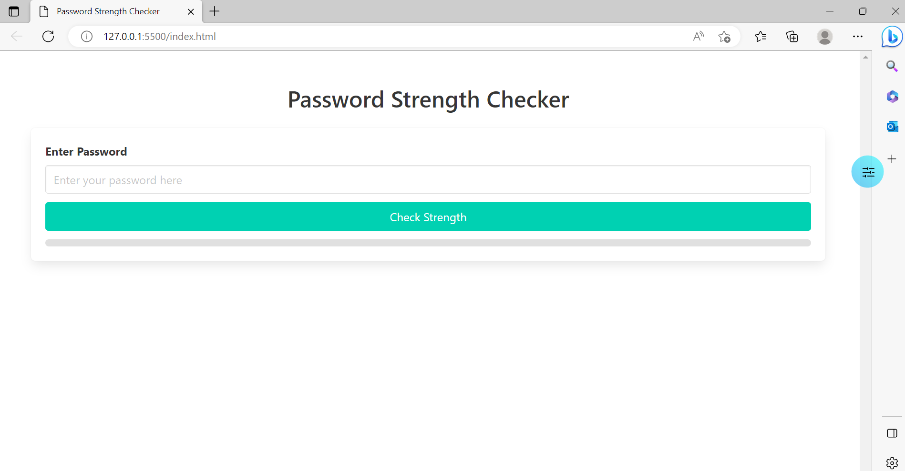
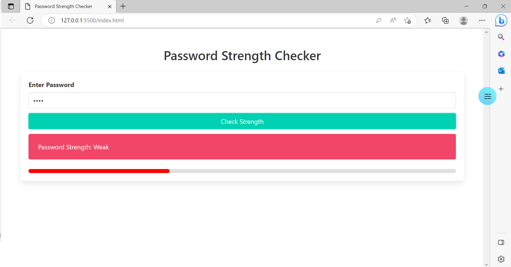
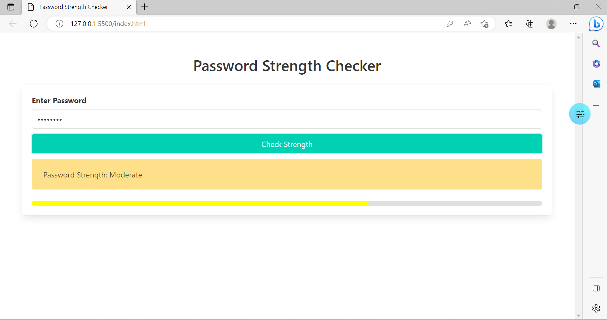
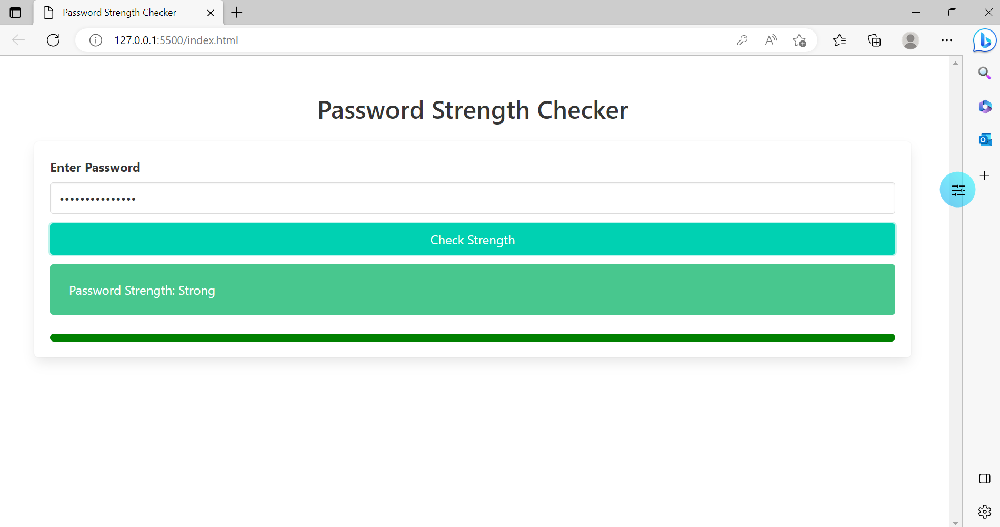

# 🔐 Password Strength Checker

## 🚀 Project Description
Password Strength Checker is an intelligent application that evaluates the strength of passwords entered by users. It leverages a **Machine Learning model (Random Forest)** to classify passwords into three levels:

✅ **Weak**  
⚖️ **Moderate**  
💪 **Strong**  

### 🔥 Features
✨ Real-time password strength classification  
🎨 Interactive and visually appealing UI  
📊 Progress bar for password strength visualization  
🔧 Robust Flask backend integrated with Machine Learning  

---
## 🖥️ Screenshots
### User Interface:

### Progress Bar:




---
## 🛠️ Technologies Used
- 🎨 **Frontend:** HTML, CSS (Bulma), JavaScript
- ⚙️ **Backend:** Flask (Python)
- 🤖 **Machine Learning Model:** scikit-learn

---
## 📋 Prerequisites
Before starting, make sure you have the following installed:
- 🐍 Python 3.8 or higher
- 📦 pip (Python package manager)

---
## 🔧 Installation Instructions

### 1️⃣ Clone the Repository
```bash
https://github.combautistao2/IA-PassChecker.git
cd IA-PassChecker
```

### 2️⃣ Create a Virtual Environment
```bash
python -m venv venv
source venv/bin/activate  # On Windows: venv\Scripts\activate
```

### 3️⃣ Install Dependencies
```bash
pip install -r requirements.txt
```

### 4️⃣ Run the Flask Server 🚀
```bash
python password_strength_api.py
```
🔗 The server will be available at: [http://127.0.0.1:5000](http://127.0.0.1:5000).

### 5️⃣ Serve the Frontend 🌐
In another terminal, start a local server:
```bash
python -m http.server 8000
```
🔗 Open [http://127.0.0.1:8000](http://127.0.0.1:8000) in your browser to use the application.

---
## 🎯 Usage Instructions
1️⃣ Enter a password in the input field.  
2️⃣ Click **"Check Strength"**.  
3️⃣ View the password strength level along with a progress bar.  

---
## 📂 Project Structure
```
password-strength-checker/
├── password_strength_api.py     # Backend Flask
├── password_strength_model.pkl  # Trained model
├── index.html                   # Frontend
├── Data                         # folder to save the data
    ├── password_dataset.csv        
├── README.md                    # Project documentation
├── requirements.txt             # Project dependencies
├── train_model.py               # train model
```

---
## 🤝 Contributing
We welcome contributions! 🛠️ If you find bugs or have ideas for improvements, feel free to open an **issue** or submit a **pull request**.

## **📧 Contact**
For questions, feedback, or collaboration, feel free to reach out:
- **Name**:  Ilyd Bautista
- **Email**: bautistaosta1@gmail.com
- **GitHub**: [ GitHub Profile](https://github.com/Bautistao2)
- **LinkedIn**: [LinkedIn Profile](https://linkedin.com/in/bautita1)


---
## 📝 License
This project is licensed under the **MIT License** [license.txt]📄.

💡 *Happy coding!* 🎉


